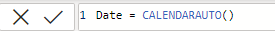
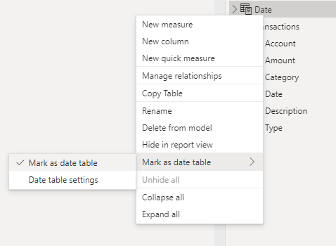
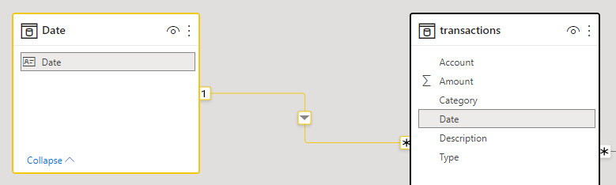

# CalendarAuto and Calendar

Using Time-Intelligence functions over missing dates is not ideal, as many of these functions assume we are using a continious list of dates

<h2>How to add a Date Table</h2>

<h3>By exiting power query and going to the data home tab</h3>

 

  

 

<h3>In this <i>example</i> the CalendarAuto() function was able to deduce when our date starts and it assumed we wanted the dates to be up till the end of the year</h3>

 

  

<h2>Mark as Date Table</h2>

 

<h3>This makes it easy to write dax functions as it tells power BI that the selected table is the most reliable source for dates</h3>

 

  

 

<h2>Creating a one to many relationship between the table and the data model</h2>

 

  

<h3>Its important as our transaction dates repeat in our transactions table</h3>

<h3>Creating a date table or <i>Date Dimension</i> is a common practice in data modelling because of its ability to give us a continious list of dates</h3>

