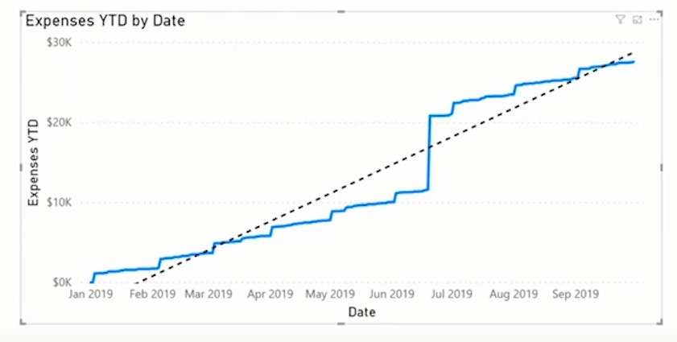
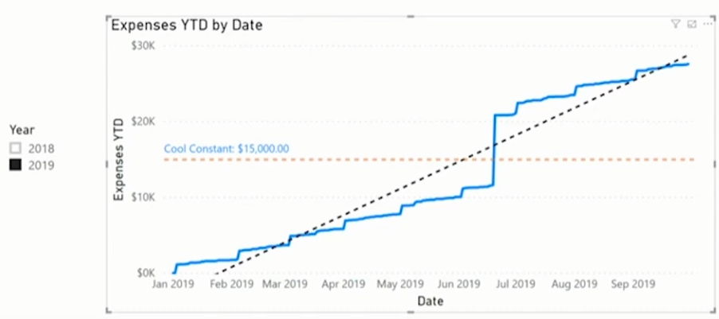
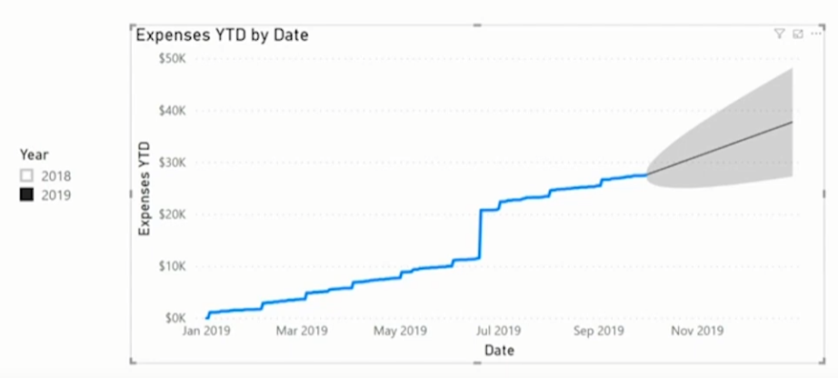

# Chart Analytics

<h2>Trend Line</h2>

Next to the format settings, we have a logo for analytics

>The trend Line will add a dashed line trough our chart that roughly track the progression of our expenses for the earlierst date to the latest date

  

<h2>Constant Line</h2>

>The Constant Line will add a dashed line that's constant, and we can choose its value ourselves

  

<h2>Forcast</h2>

>Will make a guess based on our previous Data

  

