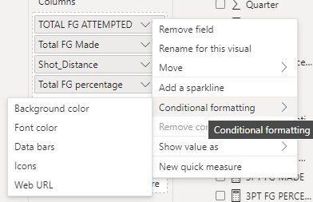
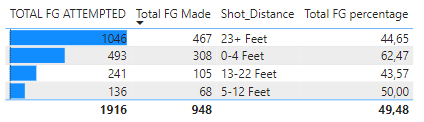
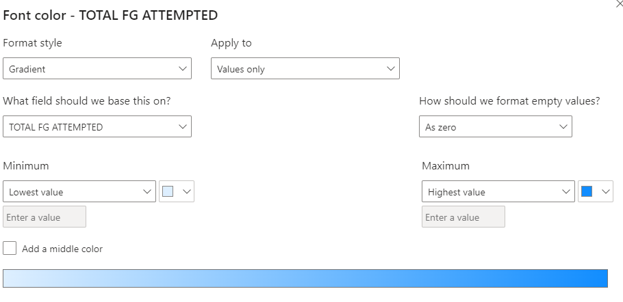
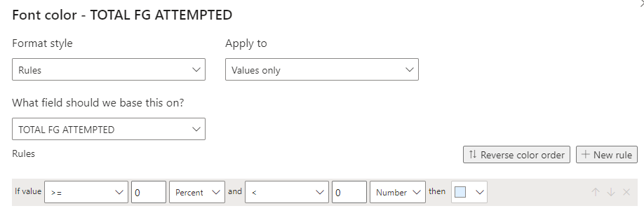

# Conditional Formatting

Alows us to change the cell appearance based on field values

  

>*example*: Making our audiance undestand that Steph cury makes shots above 23 Feet most of the time

  

<h2>Gradient Color Scalling</h2>

Choose between two colors, a min and a max, and any values in those numbers will be colored accordingly between the two colors

> the color bar illustrates how the formating will appear 

  

<h2>Rule Color Scalling</h2>

Works Like conditional collumns

  

<h2>Color by Field Values</h2>

In case our fields contained colors (Hex Colors)

