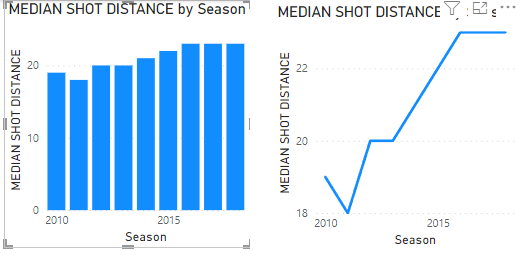

# Data Visualisations

Data Visualisations can be deceitfull, either intentionally or not, altough numbers don't lie, charts can interpret those numbers in a way that skew our perspective

> *example*: The line chart makes the median shot distance appear too pronounced, Due to the Y axis being truncated

  

