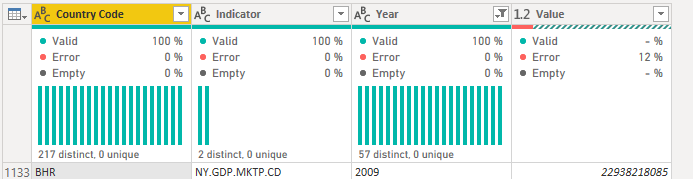
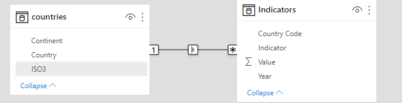
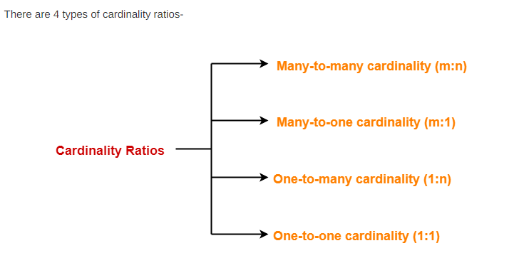

# Granularity and Relationships

<h3>Merging queries with small data models is tottally acceptable, but as the data model gets larger it becomes much harder to merge multiple querries into one, and the payoff diminshing</h3>

 

By creating relationships we allow them to share data with each other in more efficient way

<h3>In data modeling, Granularity is used to describe the type of data, most commonly in the context of our rows, and what entities comprise a row in our data set</h3>

 

> 
 We can say that the grain of this table is one row per country per indicator per year 

  

 Granularity is important due to the following 

| Understanding how tables relate to each other | Understanding how the data gets calculated |
| :-------------------------------------------- | -----------------------------------------: |

 

<h2>Creating a Relationship</h2>

<h3>In the model view we create a RS by dragging ISO3 into Country code</h3>

>This makes the Tables Talk to each other

  

>Hovering over the line will make the relationship fields highlighted
>>The "1" and "*" stand for one to many cardinality, the most common to use in power BI
>>> The arrow is the cross filter direction, an important facet of RS when we filter data using filter or slicers, it tells power BI in wich direction the filters should propagate in other words, if I filter the countries table to just those rows where continent equals south america, that filter will move in that direction of our arrow to the indicators table where it will turn the indicators to just those countries in south america

[Learn more about relationship directions](https://radacad.com/what-is-the-direction-of-relationship-in-power-bi)

  

> The many to one is the inverse, where both collumns contain unique values

> Many to Many is a more advanced Technique in wich the two table may have the same or diffrent Granularity but both collumns in the relationship can contain duplicate values, this is usually reversed for complex modeling scenarions