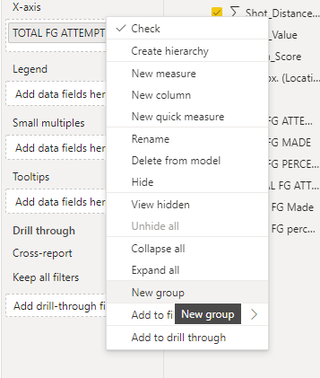

# Grouping

<h2>Create a new group</h2>

  

<h3>Group types</h3>

 

**Bins**, divide our data into equally sized groups

>*example*: If we choose 7, power BI will group the first seven and so on, until there are no ungrouped values remaining
 

**lists**, we specify each values go to each groups
>*example*: grouping shots for 0-4 Ft as closeups, and so on
