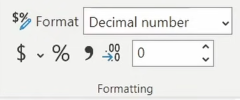

# How to use Power BI DAX

<h2>A measure is a calculation that's going to run accross our data model</h2>

<br>

<h3>Parameters</h3>

 ```js
 TOTAL FG ATTEMPTED = DISTINCTCOUNT(CurryShots[Shot ID])

 //Defined once to be refrenced and filtered in other measures
 ```

TOTAL FG ATTEMPTED == The mesure name

DISTINCTCOUNT == The function

The parameters == () Table[Field] || Table

> Its very important to know that if the table has spaces we wrap it in a string

<br>

<h3>Format Measures</h3>

<p align="center">
  
</p>

<br>

> Once we apply the formating once a measure, when we use it again the same formating will apply