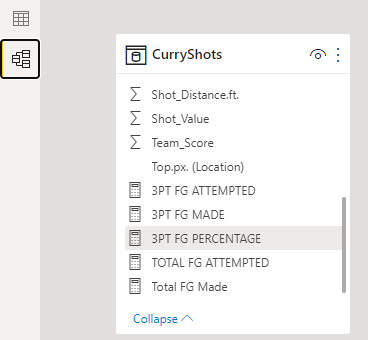
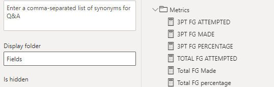

# Model View

<h2>

**The Model TAB** :

</h2>
Click the model Tab to see all the tables in our model and how they relate to each other 

  

Group all measures into a folder within our Dataset, making them easy to find, Group other things into other folders, Making our dataset nice and organised

  

! Organise your data models, especeially as they get more complex