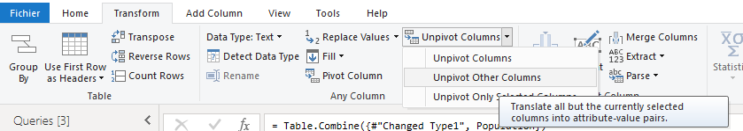

# Pivot and Unpivot

<h2>The Matrix Data format is very inflexible, and about the worst possible data format for Power BI</h2>

--- 
 
<h3>Pivot Takes Rows and transforms them into Collumns</h3>

 

<h3>Unpivot Takes Collumns and transforms them into Rows</h3>

  

