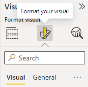

# Scatter_Charts

<h2>

**Cartesian coordinates** :

</h2>
Cartesian coordinates are a fantastic way of visualising sport data, cuz most sports occur on a bounded two dimentional plain(Field, Court)

 
<h2>

**Format settings** :

</h2>   

  

All visuals have format settings that we can customise in power BI

This includes fonts, shapes, interaction, colors, etc.., options vary between diffrent types of visuals.