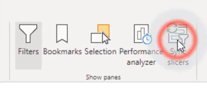
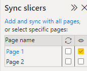

# Slicers

<h2>Slicer Synchronisation</h2>

---

Click The Slicer Synchronisation Button

  

This will open a new pane in our report editor

Go back to the page containing ur slicer, and select the slicer you want synch

  

The refresh collumn represent synchronisation

The second collumn represent visibility, so you can have a cover page for your audience to select from and that will control data in all subsequent pages

Moving the slicer in one page does not move it in other pages

