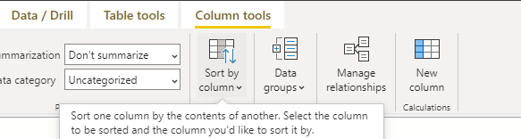

<h1 align = "center">    Sort By Collumn
</h1>
<h2>Power BI always wants to sort Text Data alphabeticly</h2>

 

<h3>

As a result when we try to sort by month our year starts in 
**April**</h3>

> A really easy way to fix this in Power BI is to do the following

>Select our column and in column tools select Sort by column

 

  

 

> Choose from the dropdown menu, it will allow you to use another collumn to sort by, it could tell power BI to overwrite the alphabetical sorting and using a **Numerical** sorting instead 

> <i style = "font-size: 18px">You might need to change datatype</i>

